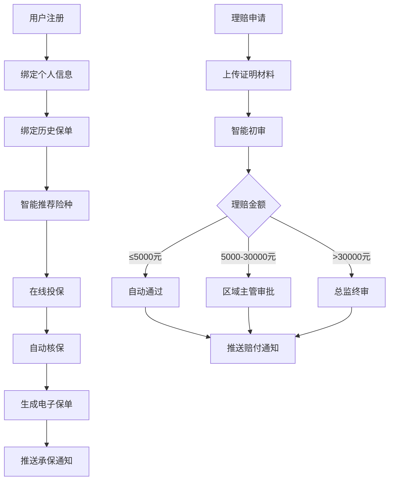

## 1. 产品概述

综合智慧保险服务平台是一款面向保险客户、代理人和管理员的全功能保险服务应用，提供智能投保、理赔、健康管理、代理人管理等一站式服务。通过AI驱动的智能推荐和自动化流程，提升保险服务效率和用户体验。

- 目标用户：保险客户、保险代理人、平台管理员
- 核心价值：智能化、高效化、个性化的保险全生命周期服务

## 2. 核心功能

### 2.1 用户角色

| 角色 | 注册方式 | 核心权限 |
|------|---------|---------|
| 客户 | 手机号/邮箱注册 | 投保、理赔、健康评估、会员管理 |
| 代理人 | 平台认证注册 | 创建团队、查看佣金、管理客户 |
| 管理员 | 后台授权登录 | 数据看板、运营管理、报表导出 |

### 2.2 功能模块

1. **用户中心**：注册登录、个人信息管理、历史保单绑定
2. **智能投保**：险种推荐、在线投保、自动核保、电子保单
3. **理赔服务**：材料上传、智能初审、多级审批、赔付通知
4. **代理人系统**：团队管理、佣金计算、工资单生成
5. **健康管理**：体检报告上传、健康评分、风险提醒
6. **续期服务**：到期提醒、保障冻结、续保通道
7. **会员体系**：等级权益、升级进度、专属礼遇
8. **管理看板**：实时数据、多维度筛选、报表导出

### 2.3 页面详情

| 页面名称 | 模块名称 | 功能描述 |
|---------|---------|---------|
| 登录注册页 | 认证模块 | 手机号/邮箱注册、密码登录、验证码登录 |
| 首页 | 仪表盘 | 保障概览、推荐险种、快捷入口、消息通知 |
| 投保中心 | 投保模块 | 险种列表、智能推荐、投保流程、核保结果 |
| 保单管理 | 保单模块 | 保单列表、保单详情、电子保单下载 |
| 理赔中心 | 理赔模块 | 理赔申请、材料上传、进度查询、审批流程 |
| 健康中心 | 健康模块 | 体检报告、健康评分、改善建议、异常提醒 |
| 代理人工作台 | 代理人模块 | 团队管理、佣金明细、工资单、客户管理 |
| 会员中心 | 会员模块 | 等级权益、升级进度、专属礼遇 |
| 管理员看板 | 管理模块 | 数据统计、实时监控、筛选查询、报表导出 |

## 3. 核心流程

### 3.1 投保流程
用户选择险种→填写被保人信息→设置保额和受益人→系统自动核保→生成电子保单→推送承保通知

### 3.2 理赔流程
用户提交理赔申请→上传事故照片和证明材料→系统智能初审→金额≤5000自动通过/5000<金额≤30000区域主管审批/金额>30000总监终审→审批通过→推送赔付到账通知

### 3.3 代理人佣金计算
代理人创建团队→系统统计月度保费→自动计算佣金层级→生成分佣明细→生成工资单

## 4. 用户界面设计

### 4.1 设计风格
- **主色调**：深邃蓝色 (#165DFF) 代表专业、信任、安全
- **辅助色**：翡翠绿 (#00B42A) 代表健康、成功，琥珀橙 (#FF7D00) 代表提醒、活力
- **中性色**：深灰 (#1D2129)、中灰 (#4E5969)、浅灰 (#C9CDD4)、纯白 (#FFFFFF)
- **按钮风格**：圆角矩形，微阴影，hover时有轻微上浮效果
- **字体**：标题使用思源黑体 Bold，正文使用思源黑体 Regular，数字使用等宽字体
- **布局风格**：卡片式布局，清晰的信息层级，充足的留白
- **图标风格**：线性图标，2px描边，统一圆角

### 4.2 页面设计概述

| 页面名称 | 模块名称 | UI元素 |
|---------|---------|--------|
| 登录注册页 | 认证模块 | 渐变背景、浮动卡片、表单动效、社交登录按钮 |
| 首页 | 仪表盘 | 顶部导航、数据卡片网格、推荐轮播、快捷操作图标 |
| 投保中心 | 投保模块 | 筛选标签栏、险种卡片、步骤指示器、表单分步引导 |
| 保单管理 | 保单模块 | 列表视图/卡片视图切换、保单状态标签、筛选条件 |
| 理赔中心 | 理赔模块 | 进度时间轴、上传区域、审批流程图、状态徽章 |
| 健康中心 | 健康模块 | 仪表盘式评分展示、雷达图、建议卡片、异常指标高亮 |
| 代理人工作台 | 代理人模块 | 团队树状图、佣金图表、工资单表格、数据统计 |
| 会员中心 | 会员模块 | 等级徽章、进度条、权益卡片网格、专属礼遇轮播 |
| 管理员看板 | 管理模块 | 数据大屏布局、图表网格、筛选器、导出按钮 |

### 4.3 响应式
- Desktop-first设计，断点：1200px（桌面）、768px（平板）、375px（手机）
- 移动端采用底部导航栏，桌面端采用侧边栏导航
- 表格在移动端自动转换为卡片列表
- 触控目标最小44px×44px

### 4.4 动效设计
- 页面切换：淡入淡出+轻微位移
- 数据加载：骨架屏+骨架动画
- 按钮交互：按下时缩放0.98，hover时上浮2px
- 表单验证：错误时轻微抖动+红色边框闪烁
- 进度更新：数字滚动动画
