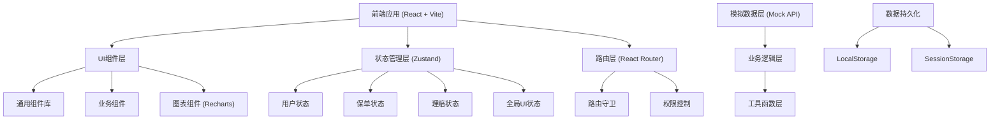
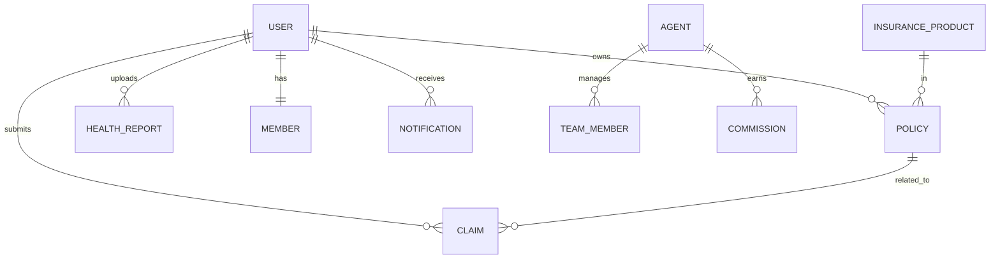

## 1. 架构设计



## 2. 技术描述

- **前端框架**: React@18 + TypeScript@5
- **构建工具**: Vite@5
- **样式方案**: TailwindCSS@3 + CSS Variables
- **路由管理**: React Router@6
- **状态管理**: Zustand@4
- **图表库**: Recharts@2
- **图标库**: Lucide React
- **表单处理**: React Hook Form + Zod
- **日期处理**: Day.js
- **后端**: 无后端，使用Mock数据模拟API
- **数据存储**: LocalStorage + SessionStorage

## 3. 路由定义

| 路由 | 页面 | 权限 |
|------|------|------|
| /login | 登录页 | 公开 |
| /register | 注册页 | 公开 |
| / | 首页仪表盘 | 登录用户 |
| /insurance | 投保中心 | 客户 |
| /policies | 保单管理 | 客户 |
| /claims | 理赔中心 | 客户 |
| /health | 健康中心 | 客户 |
| /member | 会员中心 | 客户 |
| /agent | 代理人工作台 | 代理人 |
| /admin | 管理员看板 | 管理员 |
| /profile | 个人中心 | 登录用户 |

## 4. 数据模型

### 4.1 数据模型ER图



### 4.2 核心数据类型定义

```typescript
// 用户类型
interface User {
  id: string;
  name: string;
  phone: string;
  email: string;
  idCard: string;
  role: 'customer' | 'agent' | 'admin';
  avatar?: string;
  memberLevel?: 'silver' | 'gold' | 'diamond';
  annualPremium: number;
  renewalCount: number;
  createTime: string;
}

// 保单类型
interface Policy {
  id: string;
  policyNo: string;
  userId: string;
  productId: string;
  productName: string;
  insuredName: string;
  insuredIdCard: string;
  beneficiary: string;
  amount: number;
  premium: number;
  status: 'pending' | 'active' | 'expired' | 'cancelled';
  startDate: string;
  endDate: string;
  createTime: string;
}

// 理赔类型
interface Claim {
  id: string;
  claimNo: string;
  policyId: string;
  userId: string;
  amount: number;
  accidentType: string;
  accidentDate: string;
  description: string;
  materials: string[];
  status: 'pending' | 'reviewing' | 'approved' | 'rejected' | 'paid';
  approvalLevel: 0 | 1 | 2; // 0:系统初审 1:区域主管 2:总监
  currentApprover?: string;
  createTime: string;
}

// 健康报告
interface HealthReport {
  id: string;
  userId: string;
  reportDate: string;
  score: number;
  riskLevel: 'low' | 'medium' | 'high';
  indicators: HealthIndicator[];
  suggestions: string[];
}

// 代理人佣金
interface Commission {
  id: string;
  agentId: string;
  month: string;
  totalPremium: number;
  commissionLevel: number;
  commissionRate: number;
  commissionAmount: number;
  details: CommissionDetail[];
}
```

## 5. 目录结构

```
src/
├── assets/          # 静态资源
├── components/      # 通用组件
│   ├── ui/         # 基础UI组件
│   ├── layout/     # 布局组件
│   └── charts/     # 图表组件
├── pages/          # 页面组件
│   ├── auth/       # 认证页面
│   ├── home/       # 首页
│   ├── insurance/  # 投保
│   ├── policy/     # 保单
│   ├── claim/      # 理赔
│   ├── health/     # 健康
│   ├── member/     # 会员
│   ├── agent/      # 代理人
│   └── admin/      # 管理
├── store/          # 状态管理
├── types/          # TypeScript类型
├── utils/          # 工具函数
├── mock/           # 模拟数据
├── hooks/          # 自定义Hooks
├── router/         # 路由配置
└── App.tsx
```

## 6. 核心业务逻辑

### 6.1 智能推荐算法
- 基于用户年龄、性别、健康状况推荐险种
- 基于历史理赔记录调整推荐优先级
- 基于季节因素推荐热销险种

### 6.2 自动核保规则
- 年龄校验：被保人年龄需在险种承保范围内
- 健康告知：根据健康状况自动判定
- 保额校验：自动计算最高可投保额

### 6.3 多级审批规则
- ≤5000元：系统自动审批通过
- 5000-30000元：推送区域主管审批
- >30000元：推送总监终审

### 6.4 佣金层级计算
- 月度保费<10万：佣金率15%
- 10万≤月度保费<30万：佣金率20%
- 30万≤月度保费<50万：佣金率25%
- 月度保费≥50万：佣金率30%

### 6.5 会员等级规则
- 银卡：年保费≥5000或续保≥2次
- 金卡：年保费≥20000或续保≥5次
- 钻石：年保费≥50000或续保≥10次
